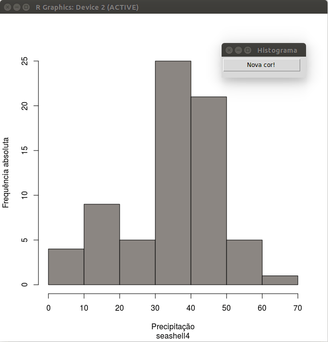

> Ferramentas para criação de GUIs interativas no R  
> (John Verzani)  

## Instalação

[http://cran.r-project.org/web/packages/gWidgets/](http://cran.r-project.org/web/packages/gWidgets/)  
[https://github.com/jverzani/gWidgets2](https://github.com/jverzani/gWidgets2)

```{r, eval=FALSE,  bootstrap.show.code=FALSE}
install.packages("gWidgets")
require(gWidgets)
options(guiToolkit = "tcltk") ## RGtk2
```

## Exemplos

### Botão de ação (gbutton)

```{r, eval=FALSE}

require(gWidgets)
options(guiToolkit="tcltk")

x <- precip
ht <- hist(x)

hist.reactive <- function(...){
    col <- sample(colors(), size=1)
    plot(ht, main=NULL,
         ylab="Frequência absoluta", xlab="Precipitação",
         col=col, sub=col)
}

w <- gwindow("Histograma")
gbutton(text="Nova cor!", container=w, handler=hist.reactive)

```



### Caixa de seleção (gcheckbox)

```{r, eval=FALSE}

require(gWidgets)
options(guiToolkit="tcltk")

x <- precip
ht <- hist(x)
col <- rep("#3366CC", length(ht$counts))

hist.reactive <- function(...){
    if(svalue(modal)){
        col[which.max(ht$counts)] <- "#142952"
    }
    plot(ht, col=col, main=NULL,
         ylab="Frequência absoluta",
         xlab="Precipitação")
    if(svalue(rg)){
        rug(x)
    }
}

w <- gwindow("Histograma")
rg <- gcheckbox(text="Marcar sobre eixo com os valores?",
                checked=FALSE, container=w, handler=hist.reactive)
modal <- gcheckbox(text="Destacal a classe modal?",
                   checked=FALSE, container=w, handler=hist.reactive)

```


### Caixas de seleção múltipla (gcheckboxgroup)

```{r, eval=FALSE}

require(gWidgets)
options(guiToolkit="tcltk")

x <- precip
ht <- hist(x)
nc <- length(ht$counts)

cols <- c(Vermelho="#F81D54", Amarelo="#FF9F1E", Azul="#2791E1", Verde="#72F51D")
cols2 <- c(cols, rev(cols))

hist.reactive <- function(...){
    seqcol <- colorRampPalette(cols2[svalue(colors)])
    plot(ht, col=seqcol(nc),
         main=NULL,
         ylab="Frequência absoluta",
         xlab="Precipitação")
}

w <- gwindow("Histograma")
g <- gframe(text="Escolha as cores para interpolar:", container=w)
colors <- gcheckboxgroup(items=names(cols2),
                         checked=c(TRUE, is.na(cols2)[-1]),
                         container=g, handler=hist.reactive)

```


### Botões de incremento (gspimbutton)

```{r, eval=FALSE}

require(gWidgets)
options(guiToolkit="tcltk")

x <- precip
ht <- hist(x)

hist.reactive <- function(...){
    m <- svalue(mar)
    par(mar=c(m, m, 1, 1))
    plot(ht, col="#660066",
         main=NULL, axes=FALSE, ann=FALSE,
         xaxt="n", yaxt="n")
    box(bty="L")
    axis(side=1, cex.axis=svalue(cexaxis))
    axis(side=2, cex.axis=svalue(cexaxis))
    title(ylab="Frequência absoluta",
          xlab="Precipitação",
          line=svalue(line))
}

w <- gwindow("Histograma")
g <- gframe(text="Tamanho do texto dos eixos:", container=w)
mar <- gspinbutton(from=3, to=7, by=0.5, value=5,
                    container=g, handler=hist.reactive)
svalue(mar) <- 5
g <- gframe(text="Tamanho do texto dos eixos:", container=w)
cexaxis <- gspinbutton(from=0.5, to=2, by=0.1, value=1,
                       container=g, handler=hist.reactive)
svalue(cexaxis) <- 1
g <- gframe(text="Distância dos rótulos dos eixos:", container=w)
line <- gspinbutton(from=1, to=4, by=0.1, value=3,
                    container=g, handler=hist.reactive)
svalue(line) <- 3

```


### Múltipla escolha (gradio)

```{r, eval=FALSE}

require(gWidgets)
options(guiToolkit="tcltk")

x <- precip
ht <- hist(x)

choices <- c(Turquesa="#00CC99",
             Azul="#0066FF",
             Rosa="#FF3399",
             Laranja="#FF6600",
             Roxo="#660066",
             "Verde limão"="#99FF33")

hist.reactive <- function(...){
    plot(ht,
         col=choices[svalue(col)],
         main=NULL,
         ylab="Frequência absoluta",
         xlab="Precipitação")
}

w <- gwindow("Histograma")
g <- gframe(text="Escolha a cor para as barras:", container=w)
col <- gradio(items=names(choices),
              selected=1,
              container=g, handler=hist.reactive)

```


### Caixas de seleção (gcombobox)

```{r, eval=FALSE}

require(gWidgets)
options(guiToolkit="tcltk")

Nclass <- c("Sturges", "Scott", "Freedman-Diaconis")
Obj <- c("precip","rivers","islands")

hist.reactive <- function(...){
    L <- switch(svalue(obj),
                precip=list(x=precip, xlab="Precipitação anual média (polegadas)"),
                rivers=list(x=rivers, xlab="Comprimento dos rios (milhas)"),
                islands=list(x=islands, xlab="Área de ilhas (1000 milhas quadradas)"))
    hist(L$x,
         breaks=svalue(nclass),
         col="#8F0047",
         main=NULL,
         ylab="Frequência absoluta",
         xlab=L$xlab)
    rug(L$x)
}

w <- gwindow("Histograma")
glabel(text="Escolha o conjunto de dados:", container=w)
obj <- gcombobox(items=Obj, selected=1, container=w,
                 handler=hist.reactive)
glabel(text="Escolha a regra para número de classes:", container=w)
nclass <- gcombobox(items=Nclass, selected=1, container=w,
                    handler=hist.reactive)

w <- gwindow("Histograma")
g <- gframe(text="Escolha o conjunto de dados:", container=w)
obj <- gcombobox(items=Obj, selected=1, container=g,
                 handler=hist.reactive)
g <- gframe(text="Escolha a regra para número de classes:", container=w)
nclass <- gcombobox(items=Nclass, selected=1, container=g,
                    handler=hist.reactive)

```


### Deslizador (gslider)

```{r, eval=FALSE}

require(gWidgets)
options(guiToolkit="tcltk")

x <- precip

## Extremos com amplitude estendida em 5%.
a <- extendrange(x, f=0.05)

hist.reactive <- function(...){
    bks <- seq(a[1], a[2], length.out=svalue(nclass)+1)
    hist(x,
         breaks=bks,
         main=NULL,
         col="#008A8A",
         ylab="Frequência absoluta",
         xlab="Precipitação")
}

w <- gwindow("Histograma")
g <- gframe(text="Escolha o número de classes:", container=w)
nclass <- gslider(from=1, to=30, by=1, value=10,
                  container=g, handler=hist.reactive)

```


### Entrada de texto (gedit)

```{r, eval=FALSE}

require(gWidgets)
options(guiToolkit="tcltk")

x <- precip
ht <- hist(x)

hist.reactive <- function(...){
    plot(ht, col="#006666",
         ylab="Frequência absoluta",
         xlab="Precipitação",
         main=svalue(main),
         sub=svalue(sub))
}

w <- gwindow("Histograma")
g <- gframe(text="Texto para o título:", container=w)
main <- gedit(text=NULL,
              initial.msg="Insira e pressione Enter",
              coerce.with="as.character",
              container=g, handler=hist.reactive)
g <- gframe(text="Texto para o subtítulo:", container=w)
sub <- gedit(text=NULL,
             initial.msg="Insira e pressione Enter",
             coerce.with="as.character",
             container=g, handler=hist.reactive)

```


